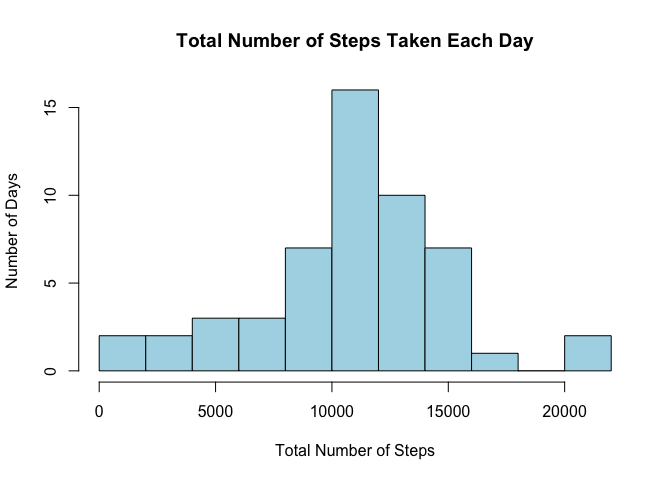
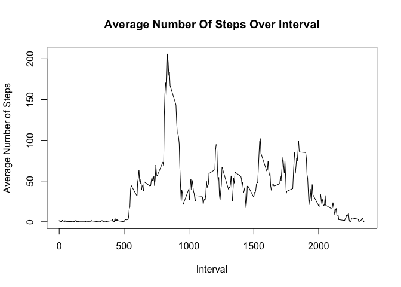
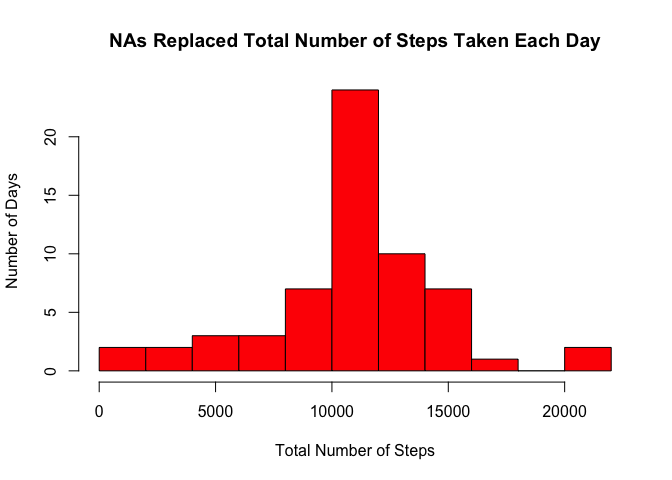
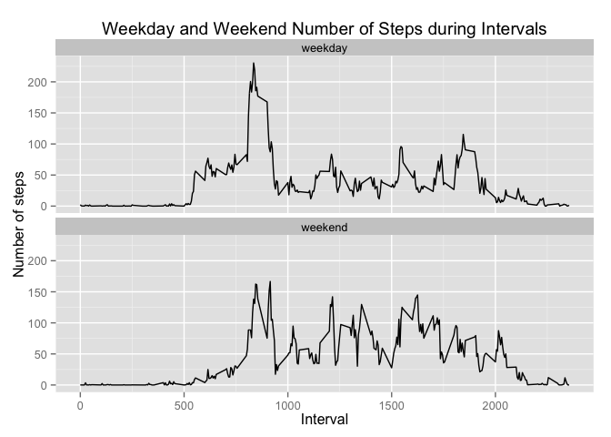

#Peer Assessment 1
##Loading and preprocessing the data
##Download dataset (https://d396qusza40orc.cloudfront.net/repdata%2Fdata%2Factivity.zip) and place it in the working directory.  Open applicable libraries.

```r
library(knitr)

library(plyr)
```

Read in data set and set date to a workable format using as.Date.

```r
activity<-read.csv("activity.csv", header=TRUE, sep = ",", na.strings="NA")

activity$date<-as.Date(activity$date,format = '%Y-%m-%d')
```


##What is mean total number of steps taken per day?
Divide data into chunks by date and add the total number of steps taken in each day.

```r
SumOfSteps<-ddply(activity, .(date), summarize, totalsteps=sum(steps))
head(SumOfSteps)
```

```
##         date totalsteps
## 1 2012-10-01         NA
## 2 2012-10-02        126
## 3 2012-10-03      11352
## 4 2012-10-04      12116
## 5 2012-10-05      13294
## 6 2012-10-06      15420
```

Create histogram of total number of steps taken each day.

```r
hist(SumOfSteps$totalsteps, col="lightblue", main="Total Number of Steps Taken Each Day", xlab="Total Number of Steps", ylab="Number of Days", breaks=10)
```

 

Calculate the mean of the number of steps taken each day.

```r
Arithmeticmean<-mean(SumOfSteps$totalsteps, na.rm=TRUE)
Arithmeticmean
```

```
## [1] 10766.19
```

Calculate the median of the number of steps taken each day.

```r
MedianValue<-median(SumOfSteps$totalsteps, na.rm=TRUE)
MedianValue
```

```
## [1] 10765
```
The mean number of steps taken each day is 10766.  The median number of steps taken per day is slightly lower at 10765.


##What is the average daily activity pattern?

Omit NA values.

```r
activity2<-na.omit(activity)
```

Calculate the mean number of steps over the assigned time intervals.

```r
MeanOfIntervals<-ddply(activity2, .(interval),summarize, totalsteps2=mean(steps))
```

Create a line graph of the average number of steps over interval.

```r
plot(MeanOfIntervals$interval, MeanOfIntervals$totalsteps, type="l", main="Average Number Of Steps Over Interval", xlab="Interval", ylab="Average Number of Steps")
```

 

Produce a summary to find the maximum value in steps.

```r
summary(MeanOfIntervals)
```

```
##     interval       totalsteps2     
##  Min.   :   0.0   Min.   :  0.000  
##  1st Qu.: 588.8   1st Qu.:  2.486  
##  Median :1177.5   Median : 34.113  
##  Mean   :1177.5   Mean   : 37.383  
##  3rd Qu.:1766.2   3rd Qu.: 52.835  
##  Max.   :2355.0   Max.   :206.170
```

Find the corresponding row and interval for the maximum value in steps.

```r
MaxStepsRow <- which.max(MeanOfIntervals$totalsteps2)
MeanOfIntervals [MaxStepsRow, ]
```

```
##     interval totalsteps2
## 104      835    206.1698
```
The mean maximum number of steps occurs during the 835 time interval with 206 steps.

##Imputing missing values
Select column to find NA values in (steps).  Create a vector with the NAs and calculate the length of the vector.

```r
stepscolumn <- activity$steps
length(stepscolumn[is.na(stepscolumn)])
```

```
## [1] 2304
```
There is a total of 2304 missing values.

Replace the NA values with the mean of the time interval.

```r
imputemean<-function(x) replace(x,is.na(x), mean(x, na.rm=TRUE))
```

Divide the data by the intervals, and then re-ordered by intervals.  Removed extra column with row numbers.

```r
activity3<-ddply(activity,~interval, transform, steps=imputemean(steps))
activityOrdered<-activity3[order(activity3$date), ]
rownames(activityOrdered) <- NULL
```

Divide data into chunks by date and add the total number of steps taken in each day.

```r
SumOfSteps2<-ddply(activityOrdered, .(date), summarize, totalsteps2=sum(steps))
```

Create a histogram showing the new data with the NA's replaced in the data.

```r
hist(SumOfSteps2$totalsteps2, col="red", main="NAs Replaced Total Number of Steps Taken Each Day", xlab="Total Number of Steps", ylab="Number of Days", breaks=10)
```

 

Calculate the mean of the number of steps taken each day.

```r
Arithmeticmean2<-mean(SumOfSteps2$totalsteps2, na.rm=TRUE)
```

Calculate the median of the number of steps taken each day and compare them to the data with the NAs still present.

```r
MedianValue2<-median(SumOfSteps2$totalsteps2, na.rm=TRUE)
Arithmeticmean
```

```
## [1] 10766.19
```

```r
Arithmeticmean2
```

```
## [1] 10766.19
```

```r
MedianValue
```

```
## [1] 10765
```

```r
MedianValue2
```

```
## [1] 10766.19
```
The mean value between the two data sets is the same.  The median value of the filled in data set is just over one step larger.


##Are there differences in activity patterns between weekdays and weekends?

Set date to a workable format using as.Date.

```r
activityOrdered$date<-as.Date(activity$date,format = '%Y-%m-%d')
```

Use the date to come up with the day name (eg Monday, Tuesday) and add a column to the data with the day name.

```r
dayname<-weekdays(activityOrdered$date)
activityDay<-cbind(activityOrdered, dayname)
```

Make a column called day type and fill it with the word "weekday".  If the day name column is Saturday or Sunday replace it with the word "weekend".

```r
activityDay$dayType <- c("weekday")

        for(i in 1:nrow(activityDay)){
                if (activityDay$dayname[i] == "Saturday" || activityDay$dayname[i] == "Sunday"){
                        activityDay$dayType[i] <- "weekend"
        }}
```

Make the day type column a factor.

```r
activityDay$dayType <- as.factor(activityDay$dayType)
```

Split the data into subsets based on day type, calculate the mean number of steps for the interval, combine the data back together ordered by interval.

```r
DataOrdered <- aggregate(steps ~ interval + dayType, activityDay, mean)
```

Open the ggplot2 library.  Make a plot comparing the number of steps on the weekend and weekdays over the assigned intervals.

```r
library(ggplot2)
qplot(interval, steps, data = DataOrdered, type = 'l', geom=c("line"),xlab = "Interval", ylab = "Number of steps", main = "Weekday and Weekend Number of Steps during Intervals") +facet_wrap(~ dayType, ncol = 1)
```

 

During the weekday activity seems to pick on average earlier then on the weekend.  During the weekday there is one large peak and on the weekend activity seems to be sporadic and throughout the whole day.
